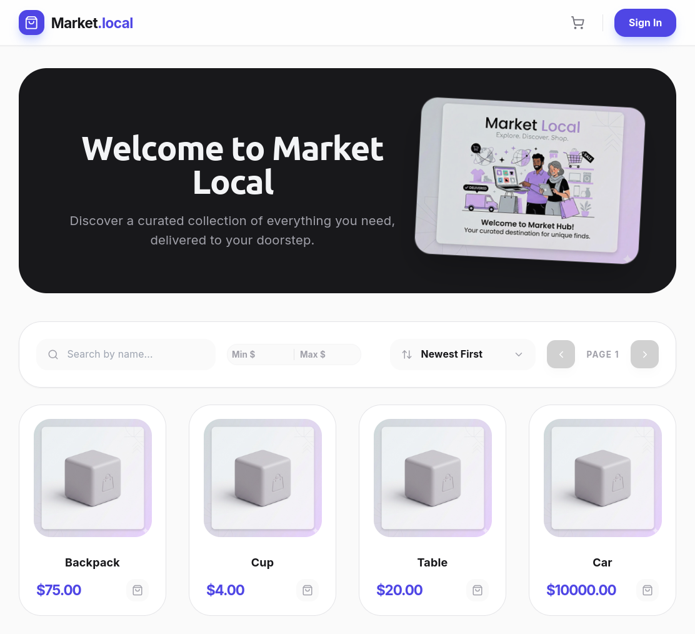
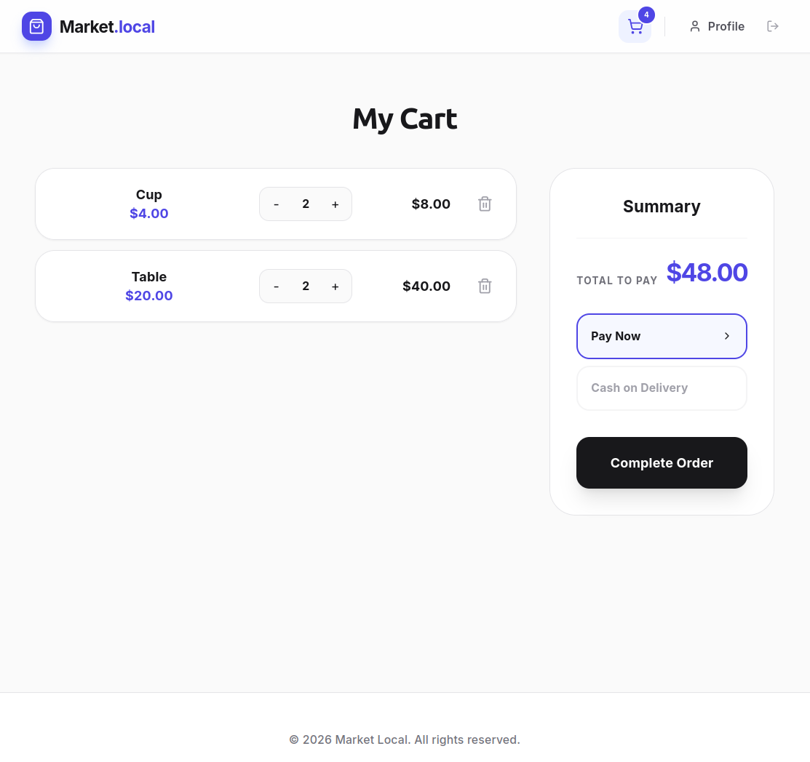
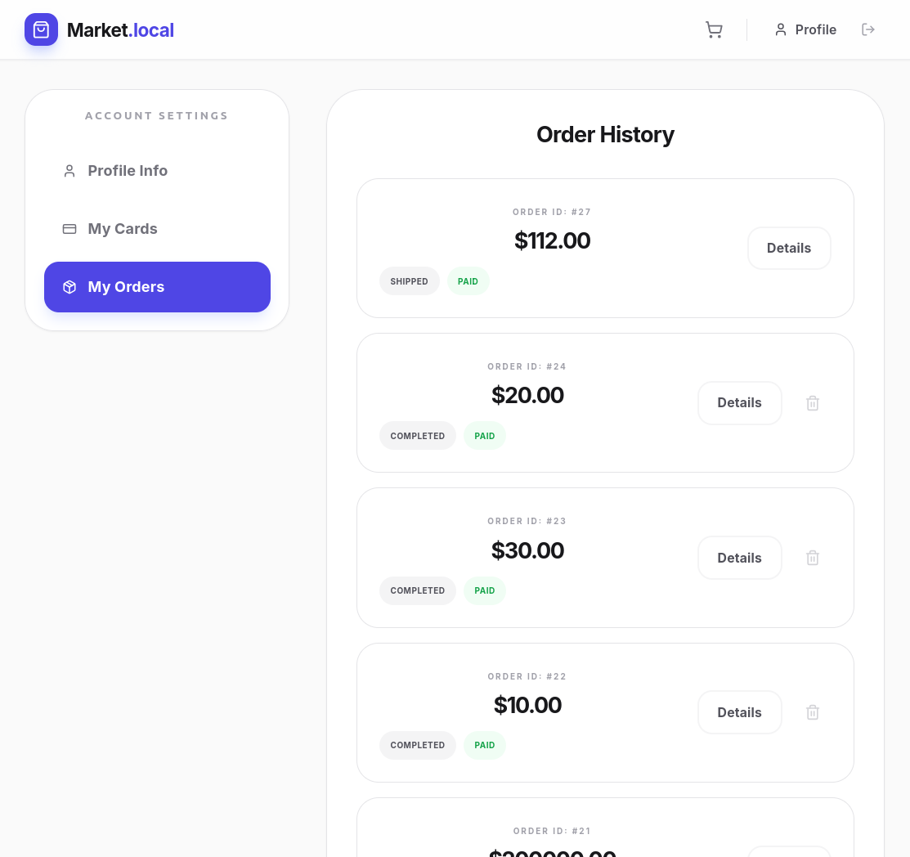
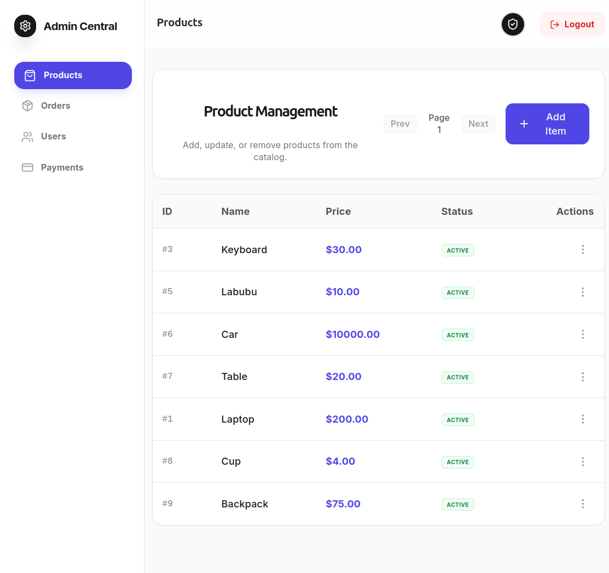
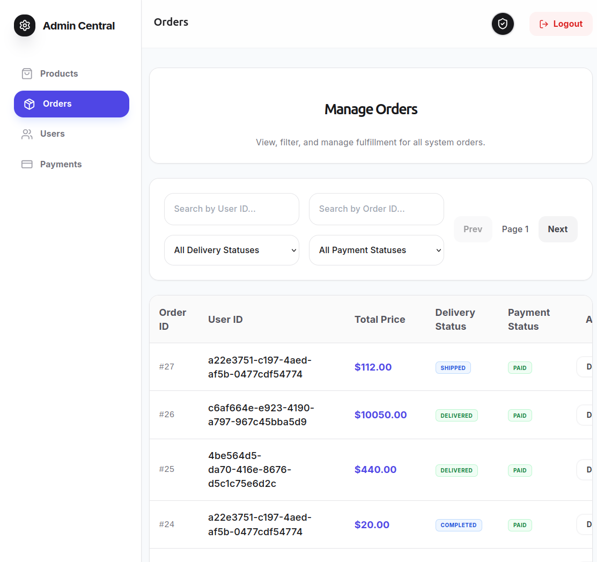

# Online Market Frontend Client 🚀💻🎨

This repository houses the production-grade, highly responsive web user interface for the **Online Marketplace Ecosystem**. Built on **React 18**, **TypeScript**, and **Vite**, the application delivers a seamless single-page experience (SPA) for both public consumers and platform administrators. It leverages automated OpenAPI client generation to communicate with backend microservices via a centralized API Gateway.


---

## 📸 User Interface & Design System

### 🛒 Client-Facing Storefront
Market views designed using Tailwind CSS.

<table>
  <tr>
    <td align="center"><b>Storefront Home & Catalog</b></td>
    <td align="center"><b>Shopping Cart & Checkout</b></td>
    <td align="center"><b>Customer Order History</b></td>
  </tr>
  <tr>
    <td></td>
    <td></td>
    <td></td>
  </tr>
</table>

### 🛡️ Administrative Control Panel
Internal management boards for platform administrators to handle inventory and operations workflows.

<table>
  <tr>
    <td align="center"><b>Product Catalog Management</b></td>
    <td align="center"><b>Global Order Fulfillment</b></td>
  </tr>
  <tr>
    <td></td>
    <td></td>
  </tr>
</table>

---

---

## 🛠 Tech Stack & UI Architecture

* **Core Engine:** React 18 (Functional architecture with hooks state management).
* **Build System & Tooling:** Vite (Fast Refresh & optimized asset bundling), TypeScript 5+, ESLint (Flat configuration mesh).
* **Data Fetching & Server State:** TanStack React Query v5 & Axios (Automated retry routines, cache invalidation, and custom client mutators).
* **API Code Generation:** Orval (Compiling multi-service backend OpenAPI specifications into modular type-safe React-Query client hooks).
* **Styling & Presentation:** Tailwind CSS & PostCSS (Atomic CSS design utility tokens, Inter font integration).
* **Routing & Client-Side Identity:** React Router DOM v6, Zustand (Lightweight persistent reactive identity context), JWT Decode processing.
* **Production Runtime:** Multi-stage Docker execution using NGINX Alpine to handle local path fallbacks (`try_files $uri $uri/ /index.html`).

---

## 📂 Repository Topology

The architecture separates UI view layouts, automated contract integrations, and configuration layers:

    online-market-frontend/
    ├── docs/
    │   └── openapi/           <-- OpenAPI spec definitions (user-service, order-service, api-gateway)
    ├── src/
    │   ├── api/
    │   │   ├── axios.ts       <-- Custom Axios instance (Refresh token handling & base interception)
    │   │   └── generated/     <-- Orval automated multi-service client hooks output
    │   ├── components/        <-- Atomic presentation UI inputs, controls, and components
    │   ├── layouts/           <-- Global Main Layout structures & Navigation headers
    │   └── src/main.tsx       <-- Application root bootstrapping context
    ├── Dockerfile             <-- Multi-stage production container manifest
    ├── nginx.conf             <-- NGINX routing and SPA fallback definitions
    └── orval.config.cjs       <-- OpenAPI service generator parameters mapping

---

## ⚙️ Development Bootstrapping

To set up the frontend environment locally for active development, execute the following workflow sequences:

### Step 1: Install Dependencies
Ensure you are using Node.js v18+ (Alpine-equivalent environment) and restore package targets:
```bash
    npm install
```
### Step 2: Generate Type-Safe API Hooks
The client dynamically maps remote endpoint schemas into reactive state hooks. To compile fresh code definitions from the specifications inside `./docs/openapi/`, run:
```bash
    npm run generate:api
```
*(This utilizes Orval to map specific domains such as `admin-user-service`, `user-order-service`, and `api-gateway` directly into ready-to-use React hooks).*

## 🔗 Backend Source Code and Documentation
This frontend application is designed for Market Local Ecosystem. You can check these links for comprehensive backend API documentation:
- [User Service (user-service:latest)](https://github.com/vittorio-niko/online-market-user-service)
- [API Gateway (api-gateway:latest)](https://github.com/vittorio-niko/online-market-api-gateway)
- [Order Service (order-service:latest)](https://github.com/vittorio-niko/online-market-order-service)
- [Payment Service (payment-service:latest)](https://github.com/vittorio-niko/online-market-payment-service)

### Step 3: Configure Local DNS (`/etc/hosts`)
Before spinning up the UI or attempting to authenticate against backend targets, you **MUST** configure local DNS routing. The application components and contract endpoints map strictly to domain hosts.

1. **Get your target IP address:**
    * If running services via **localhost / Docker Desktop**: use `127.0.0.1`.
    * If deploying to **Minikube**: extract your specific cluster IP by running:
```bash
     minikube ip
   ```

2. **Add the network mapping blocks** to your host operating system's configuration file (e.g., `/etc/hosts` on Linux/macOS or `C:\Windows\System32\drivers\etc\hosts` on Windows), replacing `<YOUR_MINIKUBE_IP_OR_127.0.0.1>` with the actual IP from the previous step:

    ```
    <YOUR_MINIKUBE_IP_OR_127.0.0.1>   market.local          # Frontend Web UI Entry Boundary
    <YOUR_MINIKUBE_IP_OR_127.0.0.1>   api.market.local      # Unified Microservice API Gateway 
    <YOUR_MINIKUBE_IP_OR_127.0.0.1>   logs.market.local     # Telemetry System & Grafana Dashboard
    <YOUR_MINIKUBE_IP_OR_127.0.0.1>   auth.market.local     # Identity Access Management (Keycloak)
    ```

### Step 4: Run the Development Server
Spin up Vite's local real-time execution server:
```bash
    npm run dev
```
The web client will bind onto your standard local terminal port allocation, typically available at `http://market.local:5173`.

---

## 🐳 Containerization & Kubernetes Deployment

The application features an active container execution profile designed to run seamlessly within a local **Minikube** cluster or isolated Docker runtimes.

### Local Kubernetes Setup via Minikube

1. **Bind Terminal Context to Cluster Daemon:**
```bash  
        eval $(minikube docker-env)
```
2. **Build the Production-Grade Asset Layer:**
```bash 
        docker build -t market-frontend:latest .
```

3. **Apply k8s manifests:**
```bash 
        kubectl appply -f . --recursive
```

**Routing Access Layout**
   The client application expects the external request interface to align with the NGINX Ingress profiles defined across the global cluster orchestrator:
   - Client Landing Boundary: `http://market.local`
   - Enterprise API Endpoint Gateway: `http://api.market.local`

---